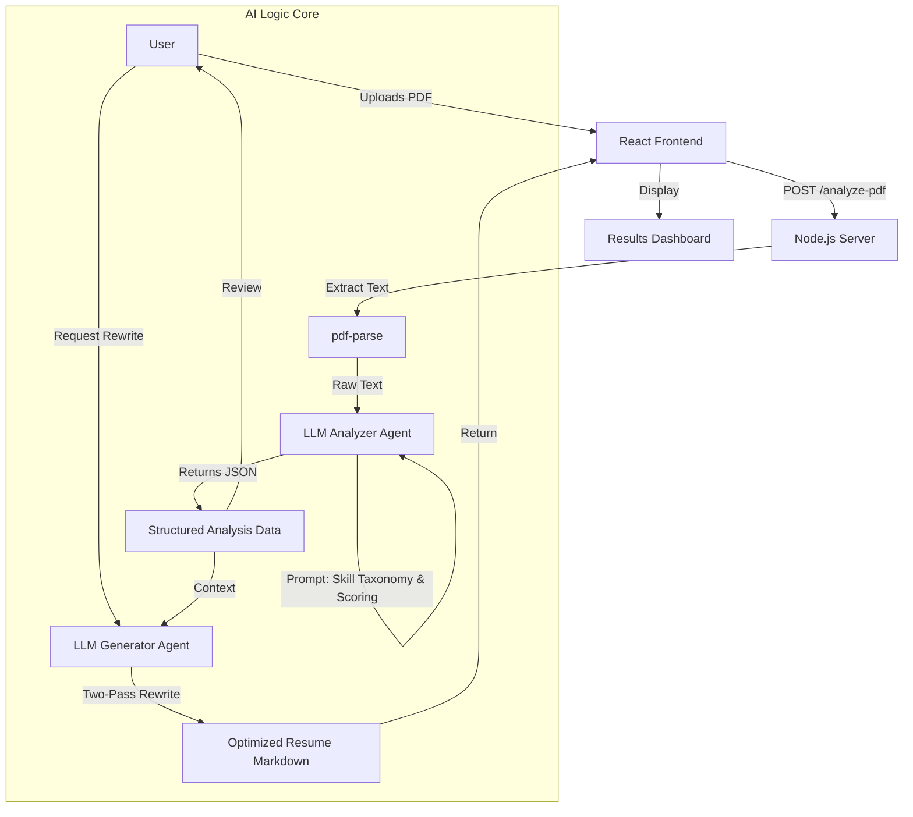

# Linkedingrow - Project Documentation

**Project Name:** Linkedingrow  
**Version:** 1.0.0  
**Last Updated:** December 19, 2025

---

## 1. Executive Summary
**Linkedingrow** is an AI-powered SaaS platform designed to help job seekers optimize their resumes for Applicant Tracking Systems (ATS). Unlike generic resume builders, it uses advanced Large Language Model (LLM) workflows to analyze resumes against specific Job Descriptions (JDs) and Target Roles, providing "explainable scoring" and generating 100% ATS-compliant rewrites.

---

## 2. Technical Architecture

### 2.1 Technology Stack
-   **Frontend**: React.js (Vite), TailwindCSS, Framer Motion (Animations), Lucide React (Icons).
-   **Backend**: Node.js, Express.js, Multer (File Handling).
-   **AI Core**: OpenAI / OpenRouter API (GPT-4 class models).
-   **Utilities**: `pdf-parse` (Text Extraction), `zustand` (State Management).

### 2.2 System Flowchart (Mermaid)



---

## 3. Core Features & Logic

### 3.1 Resume Analysis Engine
The heart of the system is the `analyzeResumeText` function. It goes beyond simple keyword counting.
-   **Inputs**: Resume Text, Target Role (optional), Job Description (optional).
-   **Skill Taxonomy**: Automatically categorizes extracted skills into:
    -   *Core Technical* (Languages, Frameworks)
    -   *Tools & Platforms* (Jira, AWS, etc.)
    -   *Domain / Business* (Agile, Strategy)
    -   *AI Skills* (LLMs, RAG - specific detection)
-   **Scoring System**:
    1.  **ATS Score**: Overall compliance.
    2.  **Match Score**: Relevance to the specific Job Description.
    3.  **Format Score**: Penalty-based (tables, images, columns).
    4.  **Content Score**: Usage of metrics and action verbs.
    5.  **Impact Score**: "Achieved X" vs "Responsible for Y".

### 3.2 Intelligent Resume Generation (Agentic Workflow)
The `/generate-resume` endpoint now uses a sophisticated **Self-Correction Loop** powered by `server/services/atsAgent.js`:

1.  **Draft Generation**: The AI writes a first pass using the "Action Formula" (`Verb + Task + Tool + Impact`).
2.  **Internal Audit**: The Agent immediately re-analyzes its own draft using strict ATS criteria.
3.  **Self-Correction**:
    *   If `ATS Score < 90`: The Agent identifies missing keywords and weak bullets.
    *   It performs a targeted rewrite (up to 2 retries) to fix these specific gaps.
4.  **Final Polish**: Only the high-scoring version is returned to the user.

### 3.3 Dashboard Visualization
-   **Score Ring**: Visual representation of the ATS score.
-   **Strength/Weakness Lists**: Dynamically populated from the AI analysis.
-   **Side-by-Side Comparison**: Renders the original text next to the generated Markdown for easy review.

---

## 4. API Documentation

### `POST /api/analyze-pdf`
Uploads and analyzes a resume file.
-   **Headers**: `Content-Type: multipart/form-data`
-   **Body**: 
    -   `file`: (Binary) PDF file.
    -   `targetRole`: (String) e.g., "Senior React Developer".
    -   `jobDescription`: (String) The full text of the target JD.
-   **Response**: `AnalysisResult` JSON (scores, keywords, rewrite_plan).

### `POST /api/generate-resume`
Generates an optimized version.
-   **Headers**: `Content-Type: application/json`
-   **Body**:
    -   `originalText`: (String) Raw resume text.
    -   `analysisResult`: (Object) The output from the analysis step.
    -   `targetRole`: (String)
    -   `jobDescription`: (String)
-   **Response**: 
    -   `generatedResume`: (String) Markdown text.
    -   `newAnalysis`: (Object) Re-analysis of the new resume.

---

## 5. Data Schemas

### Analysis Result Object
```json
{
  "ats_score": 85,
  "match_score": 90,
  "keyword_coverage": {
    "present": ["React", "TypeScript"],
    "missing": ["GraphQL", "AWS"],
    "coverage_percent": 50
  },
  "rewrite_plan": {
    "top_changes": ["Add GraphQL experience", "Fix header formatting"],
    "role_keywords_to_inject": ["CI/CD", "Docker"]
  },
  "extracted": {
    "name": "Jane Doe",
    "email": "jane@example.com",
    "skills_normalized": { "technical": ["..."] }
  }
}
```

---

## 6. Resilience & Safety
-   **JSON Fallback**: If the LLM generates malformed data, the backend catches the error and returns a "Safe Mode" report (Score 45) to prevent UI crashes.
-   **Hallucination Prevention**: Strict system prompts forbid inventing numbers or companies.
-   **Logging**: Failures are logged to `server_debug_error.log` for developer auditing.

---

## 7. Version History & Changelog

### v1.2.0 - Resilience & Experience Update (Current)
*Released: December 19, 2025*

#### **Core Architecture**
-   **Multi-Key Failover System**: Implemented a robust "Chain of Resilience" for LLM API calls:
    1.  **Primary**: OpenRouter Key 1 (GPT-120b).
    2.  **Secondary**: Auto-rotates to OpenRouter Key 2 on Rate Limit.
    3.  **Fallback**: Switches provider entirely to **Google Gemini Native API** (`gemini-2.0-flash-exp`) if all OpenRouter keys are exhausted.
    4.  **Last Resort**: Fallback to safe static analysis.
-   **Speed Optimization**: Optimized the ATS Agent loop. Reduced `MAX_RETRIES` to 1 and implemented "Smart Caching" to reuse analysis data, cutting generation time by ~40%.

#### **User Experience (UX)**
-   **Single-Page Split-View Dashboard**: Re-architected the main workflow into a unified view. Users can Upload, Analyze, Generate, and Refine without page reloads.
-   **Interactive "How It Works"**: Replaced static text with a dynamic 4-step process flow (Upload -> Gap Analysis -> AI Rewrite -> Get Hired).
-   **Standardized "Gold Standard" Styling**: Implemented CSS-enforced resume formatting (Blue accents, clean headers) to ensure professional output regardless of AI variance.
-   **"Free Forever" Pivot**: Replaced the "Pricing" page with a transparent "FAQ" page, emphasizing the free open-beta nature.

#### **Technical Improvements**
-   **New Dependencies**: `@google/generative-ai` (Native Google support), `sonner` (Beautiful Toast notifications).
-   **Error Visibility**: Added real-time User Feedback (Toasts) for connection errors or timeouts.

### v1.1.0 - Agentic Core Upgrade
-   **New Core Engine**: Replaced basic endpoint handlers with `ATSAgent` class.
-   **Self-Correction Loop**: Implemented a "Generate -> Audit -> Fix" loop.
-   **Prompt Engineering**: Adopted the "Action Verb Formula" (`Verb + Task + Tool + Impact`).

## 8. Future Roadmap
-   **Export to PDF**: Native React-PDF rendering for pixel-perfect downloads.
-   **User Database**: Persistent history of past resumes (PostgreSQL/Supabase).
-   **LinkedIn Chrome Extension**: One-click import directly from LinkedIn profile page.
