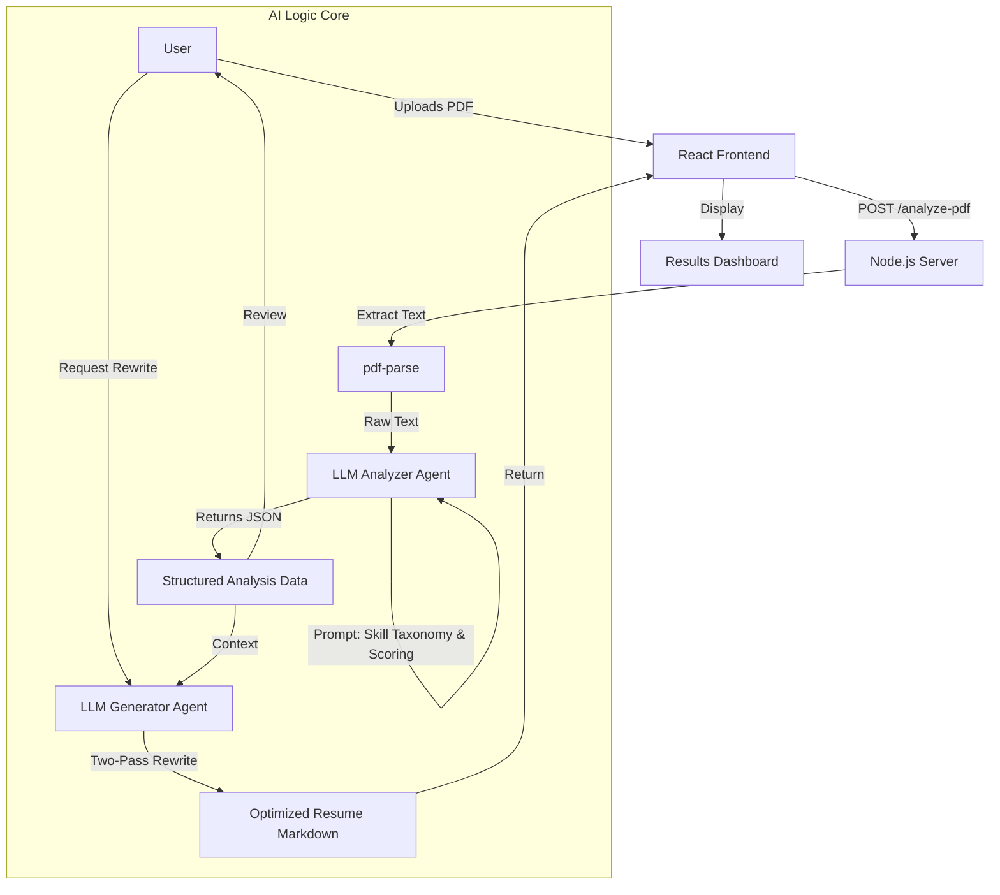

# Linkedingrow - Project Documentation

**Project Name:** Linkedingrow  
**Version:** 1.0.0  
**Last Updated:** December 19, 2025

---

## 1. Executive Summary
**Linkedingrow** is an AI-powered SaaS platform designed to help job seekers optimize their resumes for Applicant Tracking Systems (ATS). Unlike generic resume builders, it uses advanced Large Language Model (LLM) workflows to analyze resumes against specific Job Descriptions (JDs) and Target Roles, providing "explainable scoring" and generating 100% ATS-compliant rewrites.

---

## 2. Technical Architecture

### 2.1 Technology Stack
-   **Frontend**: React.js (Vite), TailwindCSS, Framer Motion (Animations), Lucide React (Icons).
-   **Backend**: Node.js, Express.js, Multer (File Handling).
-   **AI Core**: OpenAI / OpenRouter API (GPT-4 class models).
-   **Utilities**: `pdf-parse` (Text Extraction), `zustand` (State Management).

### 2.2 System Flowchart (Mermaid)



---

## 3. Core Features & Logic

### 3.1 Resume Analysis Engine
The heart of the system is the `analyzeResumeText` function. It goes beyond simple keyword counting.
-   **Inputs**: Resume Text, Target Role (optional), Job Description (optional).
-   **Skill Taxonomy**: Automatically categorizes extracted skills into:
    -   *Core Technical* (Languages, Frameworks)
    -   *Tools & Platforms* (Jira, AWS, etc.)
    -   *Domain / Business* (Agile, Strategy)
    -   *AI Skills* (LLMs, RAG - specific detection)
-   **Scoring System**:
    1.  **ATS Score**: Overall compliance.
    2.  **Match Score**: Relevance to the specific Job Description.
    3.  **Format Score**: Penalty-based (tables, images, columns).
    4.  **Content Score**: Usage of metrics and action verbs.
    5.  **Impact Score**: "Achieved X" vs "Responsible for Y".

### 3.2 Intelligent Resume Generation
The `/generate-resume` endpoint uses a **Two-Pass Safe Workflow**:
1.  **Extraction Pass**: First, the analyzer extracts PII (Name, Email, Links) into a frozen object.
2.  **Rewrite Pass**: The generator is forced to use the *frozen PII* but rewrite the *content*.
    -   **Constraint**: "Do not hallucinate metrics."
    -   **Optimization**: Injects predicted missing keywords from the Analysis phase.
    -   **Output**: Clean, standard Markdown (headers, bullets) that parsers love.

### 3.3 Dashboard Visualization
-   **Score Ring**: Visual representation of the ATS score.
-   **Strength/Weakness Lists**: Dynamically populated from the AI analysis.
-   **Side-by-Side Comparison**: Renders the original text next to the generated Markdown for easy review.

---

## 4. API Documentation

### `POST /api/analyze-pdf`
Uploads and analyzes a resume file.
-   **Headers**: `Content-Type: multipart/form-data`
-   **Body**: 
    -   `file`: (Binary) PDF file.
    -   `targetRole`: (String) e.g., "Senior React Developer".
    -   `jobDescription`: (String) The full text of the target JD.
-   **Response**: `AnalysisResult` JSON (scores, keywords, rewrite_plan).

### `POST /api/generate-resume`
Generates an optimized version.
-   **Headers**: `Content-Type: application/json`
-   **Body**:
    -   `originalText`: (String) Raw resume text.
    -   `analysisResult`: (Object) The output from the analysis step.
    -   `targetRole`: (String)
    -   `jobDescription`: (String)
-   **Response**: 
    -   `generatedResume`: (String) Markdown text.
    -   `newAnalysis`: (Object) Re-analysis of the new resume.

---

## 5. Data Schemas

### Analysis Result Object
```json
{
  "ats_score": 85,
  "match_score": 90,
  "keyword_coverage": {
    "present": ["React", "TypeScript"],
    "missing": ["GraphQL", "AWS"],
    "coverage_percent": 50
  },
  "rewrite_plan": {
    "top_changes": ["Add GraphQL experience", "Fix header formatting"],
    "role_keywords_to_inject": ["CI/CD", "Docker"]
  },
  "extracted": {
    "name": "Jane Doe",
    "email": "jane@example.com",
    "skills_normalized": { "technical": ["..."] }
  }
}
```

---

## 6. Resilience & Safety
-   **JSON Fallback**: If the LLM generates malformed data, the backend catches the error and returns a "Safe Mode" report (Score 45) to prevent UI crashes.
-   **Hallucination Prevention**: Strict system prompts forbid inventing numbers or companies.
-   **Logging**: Failures are logged to `server_debug_error.log` for developer auditing.

---

## 7. Future Roadmap
-   **Frontend Input Update**: Add UI fields for users to paste specific JDs before analysis.
-   **Export to PDF**: Convert the generated Markdown back to a clean PDF.
-   **User Auth**: Save history of past analyses (Database integration).
